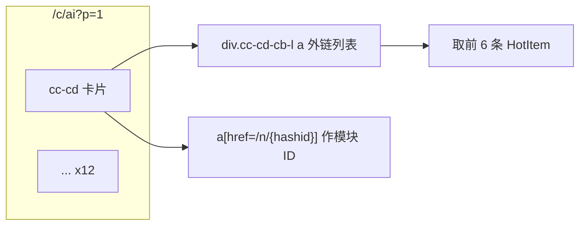
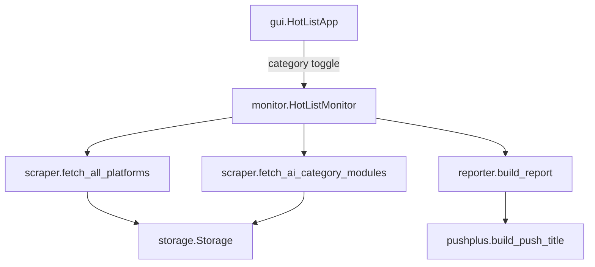

# AI 抓取推送与双分类 GUI

## 目标

- **数据源**：[`https://tophub.today/c/ai?&p=1`](https://tophub.today/c/ai?&p=1) 第一页全部模块（当前约 **12** 个 `div.cc-cd` 卡片），每个模块取 **前 6 条**。
- **行为对齐体育**：5 分钟轮询、SQLite 落库、30 天清理、08:30 / 18:30 统计报告 + PushPlus 推送（你已选择 **分两条推送**）。
- **GUI**：顶层 **体育 | AI** 切换；子页 **实时热榜 / 历史记录 / 热榜计数** 布局与交互与现有一致，仅数据范围随分类变化。

## 页面结构（已验证）



- 模块标题：`.cc-cd-lb` / `a.cc-cd-lb`
- 模块稳定键：`hashid`（如 `rYqoXz8dOD`）→ `platform_key = ai_{hashid}`
- 条目解析：复用 [`scraper.py`](scraper.py) 中 `_extract_title_from_link` / `_extract_rank_from_link`，`limit=6`

## 架构改动



### 1. 配置 — [`config.py`](config.py)

新增分类元数据（保持现有 `PLATFORMS` 不变，避免大范围重命名）：

| 常量 | 体育 | AI |
|------|------|-----|
| `category` | `sports` | `ai` |
| `TOP_N_TRACK` | 10（现有） | **6** |
| `TOP_N_REPORT` | 5 | 5 |
| 平台定义 | 静态 `PLATFORMS` | **动态**（每次抓取从页面发现） |
| 报告文件 | `data/hotlist_report.txt` | `data/ai_hotlist_report.txt` |
| 推送标题前缀 | `体育热榜` | `AI热榜` |

```python
AI_CATEGORY_URL = f"{TOPHUB_BASE_URL}/c/ai?&p=1"
CATEGORIES = {
    "sports": {"label": "体育", "platforms": PLATFORMS, ...},
    "ai": {"label": "AI", "url": AI_CATEGORY_URL, "top_n_track": 6, ...},
}
```

### 2. 抓取 — [`scraper.py`](scraper.py)

新增：

- `fetch_category_html(url, session)` — GET 分类页
- `parse_category_modules(html, limit=6)` → `Tuple[Dict[str, dict], Dict[str, List[HotItem]]]`
  - 遍历 `div.cc-cd, motion.cc-cd`
  - 每个卡片：`platform_key = f"ai_{hashid}"`，`name` 为卡片标题
  - 只保留 `href` 以 `http` 开头的链接，取前 6 条
- `fetch_ai_category_modules(session)` — 对外入口

**不**逐节点 `/n/{hashid}` 二次请求（满足「第一页每模块前六条」且减少请求量）。

### 3. 存储 — [`storage.py`](storage.py)

- Schema 增加列：`category TEXT NOT NULL DEFAULT 'sports'`
- 新索引：`(category, platform, polled_at)`
- 启动时 `_migrate_db()`：`PRAGMA table_info` 检测后 `ALTER TABLE ... ADD COLUMN`（兼容已有 `data/records.db`）
- 所有读写方法增加 `category: str` 参数（默认 `sports`）：
  - `record_poll(..., category)`
  - `count_in_window` / `count_global_in_window` / `fetch_appearances` / `count_appearances` / `count_polls_in_window` — `WHERE category = ?`

`count_global_in_window` 仅在同一 `category` 内做全站 Top5（与体育逻辑一致）。

### 4. 监控与报告 — [`monitor.py`](monitor.py) + [`reporter.py`](reporter.py) + [`pushplus.py`](pushplus.py)

**`poll_once`**（单次加锁内顺序执行）：

1. `fetch_all_platforms` → `record_poll(..., category="sports")`
2. `fetch_ai_category_modules` → 更新内存中的 `self._ai_platforms` → `record_poll(..., category="ai")`
3. `cleanup_old_records`
4. 回调改为：`on_poll_complete(results_by_category, polled_at)`  
   `results_by_category: Dict[str, Dict[str, List[HotItem]]]`

**定时报告**（同一 cron，连续两次）：

- `generate_evening_report(storage, category="sports", platforms=PLATFORMS, ...)`
- `generate_evening_report(storage, category="ai", platforms=self._ai_platforms, ...)`
- 晨间报告同理
- `build_push_title(prefix: str, report_label, content)` — `prefix` 为 `体育热榜` / `AI热榜`

### 5. GUI — [`gui.py`](gui.py)

**顶层结构**：

```
root
├── category_bar: [体育] [AI]   (ttk.Notebook 或 Radiobutton，仅切换分类)
├── notebook: 实时热榜 | 历史记录 | 热榜计数   (保持现有 3 页)
└── status_bar
```

**实时热榜**：

- `sports`：现有 2×2 `PlatformPanel`（`height=10` 不变）
- `ai`：新建可滚动区域（`Canvas` + `Scrollbar` + 2 列 `PlatformPanel`，`height=6`）；模块数动态（约 12），按 `_ai_platforms` 键创建/复用 panel
- 切换分类时 `grid_remove` / `pack` 对应容器，刷新显示该分类最近一次 poll 结果
- 工具栏「立即刷新 / 推送测试」共用；标题改为「热榜监控」

**历史 / 计数**（统一 UI，按当前分类过滤）：

- `HistoryPanel` / `CountPanel` 构造时传入 `get_category: Callable[[], str]` 与 `get_platforms: Callable[[], dict]`
- 平台下拉：`["全部"] + 当前分类平台显示名`
- 查询时 `storage.*(..., category=current_category)`

**回调**：`_schedule_ui_update` 接收 `results_by_category`，分别更新 `_last_successful["sports"]` / `["ai"]`。

### 6. 辅助更新

- [`verify.py`](verify.py)：增加 AI live fetch 分支或 `--category ai` 参数
- [`README.md`](README.md)：补充 AI 模块说明与双报告文件路径
- 窗口标题 / 推送测试文案可带当前分类前缀（可选小改）

## 关键代码锚点

现有体育 poll 入口：

```34:62:monitor.py
    def poll_once(self) -> Dict[str, List[HotItem]]:
        with self._poll_lock:
            ...
            results = fetch_all_platforms(session=self.session)
            for platform_key, items in results.items():
                ...
                self.storage.record_poll(platform_key, items, now)
```

现有 GUI 单层 Notebook（将变为「分类栏 + 原 Notebook」）：

```553:562:gui.py
        self.notebook = ttk.Notebook(self.root)
        ...
        self.notebook.add(live_tab, text="实时热榜")
        self.notebook.add(history_tab, text="历史记录")
        self.notebook.add(counts_tab, text="热榜计数")
```

## 风险与处理

| 风险 | 处理 |
|------|------|
| AI 模块列表随页面变化 | 以 `hashid` 为键；新模块自动出现，旧模块 panel 隐藏 |
| 12 模块 GUI 过高 | 可滚动 2 列网格 |
| 同名模块（如两个 MIT TR） | `hashid` 区分，不会冲突 |
| 旧 DB 无 category 列 | 迁移默认 `sports` |

## 验证步骤

1. `python -c "from scraper import fetch_ai_category_modules; ..."` — 确认 12 模块 × 6 条
2. 运行 `python main.py` — 切换体育/AI，实时榜、历史、计数数据隔离
3. `python verify.py` — 双分类落库与报告文件
4. 可选 `python verify.py --push` — 确认两条 PushPlus 标题前缀正确
