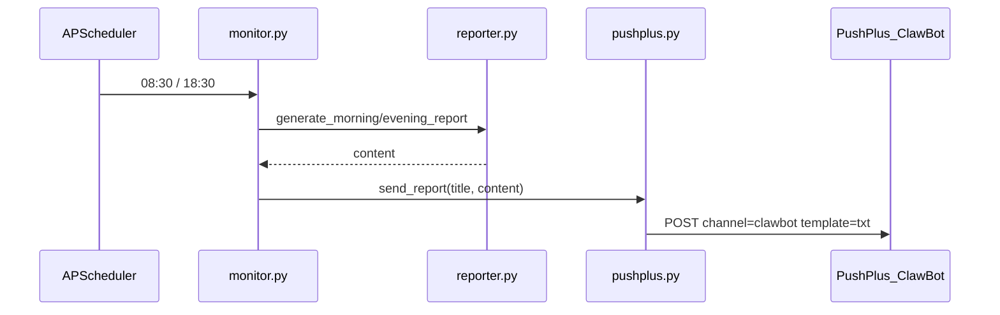

# 微信 ClawBot 定时推送

## 现状

项目**已实现**定时推送骨架，无需新建调度逻辑：

- [`monitor.py`](d:\code\Sports-Hot-List-Push\monitor.py) 已在 **08:30 / 18:30** 生成报告并调用 `send_report()`
- [`pushplus.py`](d:\code\Sports-Hot-List-Push\pushplus.py) 已 POST 到 PushPlus，但 `channel` 当前为 `"wechat"`，需改为你指定的 `"clawbot"`
- [`config.py`](d:\code\Sports-Hot-List-Push\config.py) 已有 `PUSHPLUS_TOKEN` / `PUSHPLUS_API_URL` / `PUSHPLUS_ENABLED`



## 核心改动

### 1. 修改推送 payload — [`pushplus.py`](d:\code\Sports-Hot-List-Push\pushplus.py)

将 `send_report()` 中的请求体改为你提供的格式：

```python
payload = {
    "token": PUSHPLUS_TOKEN,
    "title": title,
    "content": content,
    "channel": PUSHPLUS_CHANNEL,  # 默认 "clawbot"
    "template": "txt",
}
```

- API 地址保持 `https://www.pushplus.plus/send`（与官方文档一致）
- 响应解析逻辑不变：`code == 200` 为成功
- `build_push_title()` 与 `monitor.py` 挂接**无需改动**

### 2. 增加渠道配置 — [`config.py`](d:\code\Sports-Hot-List-Push\config.py)

新增环境变量（可选，便于日后切换渠道）：

| 变量 | 说明 | 默认 |
|------|------|------|
| `PUSHPLUS_CHANNEL` | 发送渠道 | `clawbot` |

其余 `PUSHPLUS_TOKEN` / `PUSHPLUS_ENABLED` 逻辑保持不变。

### 3. 更新文档 — [`README.md`](d:\code\Sports-Hot-List-Push\README.md)

「手机推送」小节改为 **微信 ClawBot** 配置说明：

1. 在 [pushplus.plus](https://www.pushplus.plus) 注册并完成实名认证
2. **个人中心 → 渠道配置 → 微信 ClawBot → 立即绑定**（扫码）
3. 绑定后向 ClawBot **主动发一条消息**，监听状态变为「已激活」
4. 设置 Token：`$env:PUSHPLUS_TOKEN="你的Token"`
5. 保持 `python main.py` 常驻，每天 08:30、18:30 自动推送

**ClawBot 使用限制**（官方要求，需在 README 中注明）：

- 每推送 **10 条**后，需再主动发一条消息给 ClawBot
- 每 **24 小时**内需至少主动对话一次，否则后续推送可能失败

本项目每天 2 次推送，24 小时限制是主要注意点；建议每天固定时间给 ClawBot 发一条消息保持激活。

### 4. 补充 `.env.example`

README 已引用但仓库中缺失，新增示例（不含真实 Token）：

```
PUSHPLUS_TOKEN=your_token_here
PUSHPLUS_CHANNEL=clawbot
```

### 5. 本地验证 — [`verify.py`](d:\code\Sports-Hot-List-Push\verify.py)

已有 `--push` 联调入口，**无需改代码**。改完 channel 后执行：

```powershell
$env:PUSHPLUS_TOKEN="你的Token"
python verify.py --push
```

## 不改动的部分

- **调度时间**：08:30 / 18:30 cron 已满足「定时推送」
- **报告生成**：[`reporter.py`](d:\code\Sports-Hot-List-Push\reporter.py) 逻辑不变
- **GUI**：通过 `HotListMonitor` 间接生效，无需单独修改

## 文件变更清单

| 文件 | 操作 |
|------|------|
| [`pushplus.py`](d:\code\Sports-Hot-List-Push\pushplus.py) | `channel` 改为 `clawbot`（经配置读取） |
| [`config.py`](d:\code\Sports-Hot-List-Push\config.py) | 新增 `PUSHPLUS_CHANNEL`，默认 `clawbot` |
| [`README.md`](d:\code\Sports-Hot-List-Push\README.md) | ClawBot 绑定步骤与限制说明 |
| `.env.example` | 新建示例配置 |
