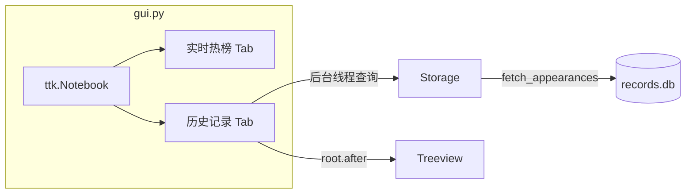

# GUI 历史记录查看方案

## 背景

[`data/records.db`](data/records.db) 是 SQLite 二进制文件，在编辑器中无法直接阅读。当前 [`gui.py`](gui.py) 只展示**最新一次抓取**的实时热榜，不读取数据库中的历史记录。用户需要在主程序内方便浏览 DB 内容。

## 目标

在主窗口增加 **Notebook 双标签页**：

- **实时热榜** — 现有 2×2 平台面板（逻辑不变）
- **历史记录** — 从 DB 查询 `appearances` 表，表格展示，支持筛选



## 1. 扩展 [`storage.py`](storage.py) — 查询接口

新增 dataclass 与两个只读方法，供 GUI 调用：

```python
@dataclass
class AppearanceRecord:
    id: int
    platform: str
    title: str
    url: Optional[str]
    rank: Optional[int]
    polled_at: str
```

- **`fetch_appearances(start, end, platform_key, limit=500, offset=0)`**  
  按 `polled_at DESC, id DESC` 排序，返回 `List[AppearanceRecord]`
- **`count_appearances(start, end, platform_key)`**  
  返回匹配总数（用于底部状态栏「共 N 条，显示 M 条」）

SQL 复用已有索引 `idx_appearances_time` / `idx_appearances_platform`，参数化查询，与现有 `count_in_window` 风格一致。

**数据量控制**：默认 `limit=500`（约 12.5 次轮询 × 4 平台 × 10 条）。全库最多约 30 万行（30 天保留），不做分页控件，通过时间范围筛选 + limit 即可满足「方便查看」。

## 2. 改造 [`gui.py`](gui.py) — 历史记录面板

### 布局调整

将现有 toolbar + 2×2 grid + status bar 包进 `ttk.Notebook` 的第一个 Tab；第二个 Tab 放 `HistoryPanel`。

```
┌─ [实时热榜] [历史记录] ──────────────────────────┐
│  平台: [全部 ▼]  时间: [今天 ▼]  [查询]           │
│  ┌──────────────────────────────────────────────┐ │
│  │ # │ 平台 │ 排名 │ 标题 │ 采集时间              │ │
│  │ 1 │ 新浪 │  1   │ ...  │ 2026-05-24 12:00:00  │ │
│  └──────────────────────────────────────────────┘ │
│  共 1200 条，显示最近 500 条                       │
└───────────────────────────────────────────────────┘
  状态：就绪 | ...
```

### 新增 `HistoryPanel` 类

| 控件 | 说明 |
|------|------|
| 平台下拉 | `全部` + `config.PLATFORMS` 四个平台（显示中文名，传 platform_key） |
| 时间下拉 | `今天` / `最近24小时` / `最近7天` / `全部`（在 GUI 层计算 start/end datetime） |
| 查询按钮 | 后台线程读 DB，`root.after(0, ...)` 更新 Treeview |
| Treeview | 列：`id`、`平台`、`排名`、`标题`、`采集时间`；维护 `item_id → url` 映射 |
| 双击行 | 复用 `webbrowser.open()` 打开链接 |
| 选中行 | 底部状态栏显示完整标题（与实时页一致） |

### 交互细节

- 切换到「历史记录」Tab 时，若尚未加载过，自动触发一次查询（默认：全部平台 + 今天）
- 查询进行中：禁用「查询」按钮，状态栏显示「正在加载历史记录...」
- DB 读取在**后台线程**执行，避免阻塞 Tkinter 主线程（与「立即刷新」模式相同）
- `HotListApp` 持有 `Storage()` 实例专供历史查询（与 `monitor.storage` 独立连接，SQLite 支持并发读）

### 时间范围映射（GUI 内实现）

| 选项 | start | end |
|------|-------|-----|
| 今天 | 当日 00:00 (Asia/Shanghai) | now |
| 最近24小时 | now - 24h | now |
| 最近7天 | now - 7d | now |
| 全部 | None | None |

使用现有 [`timezone_utils.get_tz()`](timezone_utils.py) 保持时区一致。

## 3. 更新 [`README.md`](README.md)

在「窗口操作」小节补充：

- 切换到「历史记录」标签页浏览 DB 采集记录
- 平台 / 时间筛选 + 查询
- 双击打开链接

## 文件改动汇总

| 文件 | 改动 |
|------|------|
| [`storage.py`](storage.py) | 新增 `AppearanceRecord`、`fetch_appearances`、`count_appearances` |
| [`gui.py`](gui.py) | Notebook 双 Tab、`HistoryPanel`、后台查询线程 |
| [`README.md`](README.md) | 历史记录页操作说明 |

**不新增依赖**，不改动 [`monitor.py`](monitor.py) / [`main.py`](main.py) / [`reporter.py`](reporter.py)。

## 验证方式

1. 确保 `data/records.db` 有数据（运行过 `python main.py` 或 `python verify.py`）
2. `python main.py` → 切到「历史记录」→ 默认显示今天数据
3. 切换平台 / 时间范围 → 点「查询」→ 列表与底部计数更新
4. 双击有 URL 的行 → 浏览器打开
5. 切回「实时热榜」→ 原有自动刷新与手动刷新正常
6. `python verify.py` → 不受影响
