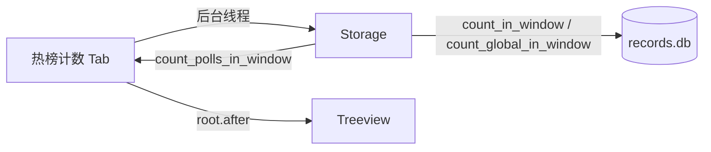

# GUI 热榜计数页

## 背景

当前 [`gui.py`](d:\code\Sports-Hot-List-Push\gui.py) 有两个标签页：

- **实时热榜** — 最新一次抓取的 rank + 标题
- **历史记录** — 原始采集行（ID、平台、排名、标题、时间）

项目中的「计数」指标题在统计窗口内**重复上榜的次数**（`CountResult.count`，报告里写作 `(N次)`），由 [`storage.py`](d:\code\Sports-Hot-List-Push\storage.py) 的 `count_in_window` / `count_global_in_window` 提供，已在 [`reporter.py`](d:\code\Sports-Hot-List-Push\reporter.py) 用于生成 `hotlist_report.txt`，但 GUI 尚未展示。

用户选择 **单一表格** 布局，支持平台与时间筛选。

## 目标布局

```
┌─ [实时热榜] [历史记录] [热榜计数] ─────────────────────┐
│  平台: [全部 ▼]  时间: [今天 ▼]  [查询]                 │
│  ┌────────────────────────────────────────────────────┐ │
│  │ # │ 平台 │ 标题 │ 次数 │ 最后出现                    │ │
│  │ 1 │ 新浪 │ ...  │  12  │ 2026-05-24 18:25:00        │ │
│  └────────────────────────────────────────────────────┘ │
│  统计窗口: ... | 采集轮次: 48 次 | 共 120 条             │
└─────────────────────────────────────────────────────────┘
  状态：就绪 | ...
```



## 实现方案

### 1. 新增 `CountPanel` 类 — [`gui.py`](d:\code\Sports-Hot-List-Push\gui.py)

结构与 [`HistoryPanel`](d:\code\Sports-Hot-List-Push\gui.py) 类似，复用已有模式：

| 控件 | 说明 |
|------|------|
| 平台下拉 | `全部` + 四个平台中文名（与历史页一致） |
| 时间下拉 | 复用 `TIME_RANGE_OPTIONS`（今天 / 最近24小时 / 最近7天 / 全部） |
| 查询按钮 | 后台线程查 DB，`root.after(0, ...)` 更新 UI |
| Treeview | 列：`#`、`平台`、`标题`、`次数`、`最后出现` |
| 底部摘要 | 统计窗口起止时间、采集轮次、结果条数 |

**数据查询逻辑**（后台 worker）：

- 平台 = `全部`：调用 `storage.count_global_in_window(start, end, limit=COUNT_FETCH_LIMIT)`  
  - 返回跨平台合并后的 `(url, title)` 频次，平台列显示该条记录的 `platform` 字段
- 平台 = 指定平台：调用 `storage.count_in_window(start, end, platform_key=..., limit=COUNT_FETCH_LIMIT)`
- 采集轮次：`storage.count_polls_in_window(start, end)` 写入摘要行
- 默认 `COUNT_FETCH_LIMIT = 100`（常量，可按次数降序取 Top 100；比历史页 500 行更合理）

**时间范围处理** — 复用 `_compute_time_range()`，但 `count_in_window` 要求非空 `start/end`：

- `今天` / `最近24小时` / `最近7天`：直接使用现有返回值
- `全部`：使用 `now - RETENTION_DAYS` ~ `now`（与 DB 保留策略一致，从 `config.RETENTION_DAYS` 导入）

**交互**（与历史页保持一致）：

- 切换到「热榜计数」Tab 时，若尚未加载，自动触发一次查询（默认：全部平台 + 今天）
- 查询中禁用按钮，状态栏显示「正在加载计数统计...」
- 双击行 → `webbrowser.open(url)`（维护 `item_id → url` 映射）
- 选中行 → 底部状态栏显示完整标题

### 2. 接入 `HotListApp`

在 `_build_ui()` 中：

- 新增 `counts_tab = ttk.Frame(self.notebook)`，标签文字 **热榜计数**
- 实例化 `CountPanel`，共用现有 `self.history_storage`（与历史页同一 `Storage` 实例即可）
- 扩展 `_on_tab_changed()`：index `2` 时调用 `count_panel.on_tab_shown()`
- 扩展 `_set_history_loading` 或新增 `_set_panel_loading(source)`，使计数页加载时状态栏文案正确；计数页选中行时不被历史页 loading 状态拦截

Tab 顺序：`实时热榜(0)` → `历史记录(1)` → `热榜计数(2)`

### 3. 不改动其他模块

- [`storage.py`](d:\code\Sports-Hot-List-Push\storage.py) — API 已完备，无需修改
- [`monitor.py`](d:\code\Sports-Hot-List-Push\monitor.py) / [`main.py`](d:\code\Sports-Hot-List-Push\main.py) — 无需改动
- 不新增依赖

### 4. 更新 [`README.md`](d:\code\Sports-Hot-List-Push\README.md)

在「窗口操作」小节补充 **热榜计数** 标签页说明：筛选平台/时间、查看出现次数、双击打开链接。

## 关键复用代码

时间范围计算（已有，直接复用）：

```45:55:d:\code\Sports-Hot-List-Push\gui.py
def _compute_time_range(option: str) -> Tuple[Optional[datetime], Optional[datetime]]:
    tz = get_tz()
    now = datetime.now(tz)
    if option == "今天":
        start = now.replace(hour=0, minute=0, second=0, microsecond=0)
        return start, now
    ...
```

计数 API（已有，直接调用）：

```81:107:d:\code\Sports-Hot-List-Push\storage.py
def count_in_window(self, start, end, platform_key=None, limit=None) -> List[CountResult]:
    ...
    GROUP BY platform, COALESCE(url, ''), title
    ORDER BY count DESC, last_seen DESC, title ASC
```

## 验证方式

1. 确保 `data/records.db` 有数据
2. `python main.py` → 切到「热榜计数」→ 默认显示今天、全部平台的频次排行
3. 切换平台 / 时间 → 点「查询」→ 表格与摘要（轮次、条数）更新
4. 双击有 URL 的行 → 浏览器打开
5. 切回「实时热榜」「历史记录」→ 原有功能不受影响
