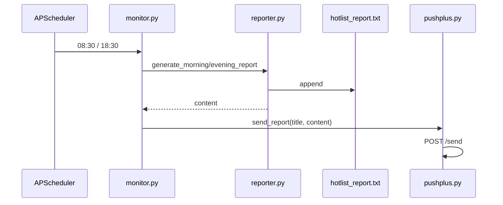

# PushPlus 定时手机推送

## 现状

- 定时任务已在 [`monitor.py`](d:\code\Sports-Hot-List-Push\monitor.py) 中配置：`CronTrigger(hour=8/18, minute=30)`，分别调用 `run_morning_report` / `run_evening_report`。
- 报告生成在 [`reporter.py`](d:\code\Sports-Hot-List-Push\reporter.py)：`generate_*_report()` 返回本次报告字符串并追加写入 [`config.REPORT_FILE`](d:\code\Sports-Hot-List-Push\config.py)（`data/hotlist_report.txt`）。
- [`data/test_hotlist_report.txt`](d:\code\Sports-Hot-List-Push\data\test_hotlist_report.txt) 是 `verify.py` 的测试输出，格式与生产报告一致；**推送应使用 `generate_*_report()` 的返回值**，而不是读历史文件。
- 仓库内**尚无**任何推送实现。



## 实现方案

### 1. 配置项 — [`config.py`](d:\code\Sports-Hot-List-Push\config.py)

新增（从环境变量读取，避免 Token 进仓库）：

| 变量 | 说明 | 默认 |
|------|------|------|
| `PUSHPLUS_TOKEN` | 用户在 [pushplus.plus](https://www.pushplus.plus) 获取的 Token | 空 |
| `PUSHPLUS_API_URL` | 发送接口 | `https://www.pushplus.plus/send` |
| `PUSHPLUS_ENABLED` | 是否启用推送 | 有 Token 时为 `true` |

用 `os.getenv` 即可，**不新增** `python-dotenv` 依赖；本地可在 PowerShell 中 `$env:PUSHPLUS_TOKEN="..."` 或在任务计划程序里配置环境变量。

### 2. 新建 [`pushplus.py`](d:\code\Sports-Hot-List-Push\pushplus.py)

核心函数：

```python
def send_report(title: str, content: str, session: requests.Session | None = None) -> bool:
```

实现要点：

- **POST JSON**：`{"token": ..., "title": ..., "content": ..., "template": "txt", "channel": "wechat"}`（纯文本报告用 `txt`，避免 HTML 转义问题）。
- 复用 `monitor` 已有的 `requests.Session`（或模块内单次 `requests.post`），超时建议 15s。
- 解析响应 JSON：`code == 200` 视为成功；否则 `logger.error` 记录 `code`/`msg`。
- **未配置 Token**：`logger.warning` 后返回 `False`，不抛异常，保证调度器继续运行。
- 报告约 4000 字，远低于 PushPlus 实名用户 **2 万字** 上限；每天 2 次推送，远低于 **200 次/日** 限额。

标题建议（从报告类型派生，便于手机区分）：

- `体育热榜 | 晨间报告 (08:30) 2026-05-24`
- `体育热榜 | 晚间报告 (18:30) 2026-05-24`

可从 `content` 中解析 `报告时间:` 行，或让 `monitor` 传入 `report_type` 字符串。

### 3. 挂接推送 — [`monitor.py`](d:\code\Sports-Hot-List-Push\monitor.py)

在 `run_evening_report` / `run_morning_report` 中，拿到 `content` 后调用推送：

```python
content = generate_evening_report(self.storage)
from pushplus import send_report  # 或顶部 import
send_report("体育热榜 | 晚间报告 (18:30)", content, session=self.session)
```

`monitor` 已有 `self.session`，可传给 PushPlus 复用连接。

### 4. 文档与示例 — [`README.md`](d:\code\Sports-Hot-List-Push\README.md) + `.env.example`

README 增加「手机推送」小节：

1. 注册 PushPlus，完成**实名认证**（未实名接口返回 `905`，无法发送）。
2. 复制 Token，设置环境变量 `PUSHPLUS_TOKEN`。
3. 保持 `python main.py` 常驻（或任务计划程序开机启动）。
4. 每天 08:30、18:30 自动生成报告并推送**当次**报告块。

`.env.example` 仅作说明（项目不自动加载 `.env`）：

```
PUSHPLUS_TOKEN=your_token_here
```

### 5. 本地验证（不等到整点）

在 [`verify.py`](d:\code\Sports-Hot-List-Push\verify.py) 末尾增加可选步骤（需设置 `PUSHPLUS_TOKEN` 才执行）：

```python
if os.getenv("PUSHPLUS_TOKEN"):
    send_report("体育热榜 | 测试推送", evening[:500] + "\n...(截断测试)")
```

或单独命令：`python -c "from pushplus import send_report; send_report('test', open('data/test_hotlist_report.txt').read())"`

用 [`data/test_hotlist_report.txt`](d:\code\Sports-Hot-List-Push\data\test_hotlist_report.txt) 中**晚间报告**那一段做一次性联调即可。

## 不改动的部分

- **调度时间**：已满足 08:30 / 18:30，无需改 cron。
- **GUI**（[`gui.py`](d:\code\Sports-Hot-List-Push\gui.py)）：通过 `HotListMonitor` 间接生效，无需单独改 UI。
- **报告逻辑**（[`reporter.py`](d:\code\Sports-Hot-List-Push\reporter.py)）：保持「生成 + 写文件 + 返回 content」职责不变。

## 风险与说明

| 项 | 说明 |
|----|------|
| 实名认证 | PushPlus 2024-08 起未实名无法调用发送接口 |
| 相同内容限制 | 1 小时内相同内容最多 3 条；测试时略改标题或内容 |
| 程序需常驻 | 推送依赖本机 `main.py` 在 08:30/18:30 时刻正在运行 |
| 晨间无数据 | 窗口内采集为 0 时仍会推送「暂无数据」报告（与当前报告行为一致） |

## 文件变更清单

| 文件 | 操作 |
|------|------|
| `pushplus.py` | 新建 |
| `config.py` | 增加 PushPlus 配置 |
| `monitor.py` | 报告生成后调用推送 |
| `README.md` | 配置与验证说明 |
| `.env.example` | 新建（示例 Token 占位） |
| `verify.py` | 可选：增加 `--push` 联调入口 |
