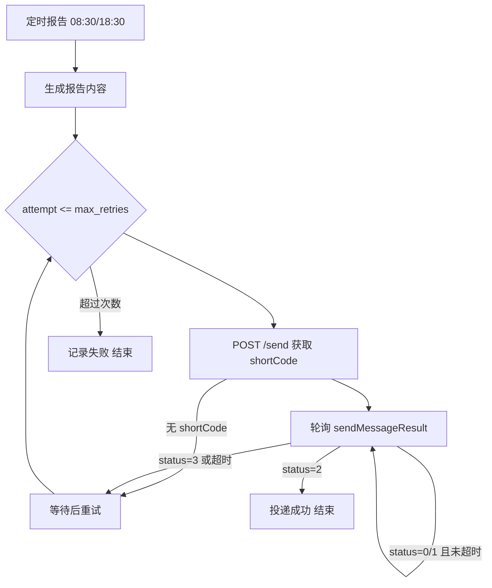

# PushPlus 定时推送验证与重发

## 背景与问题

当前 [`pushplus.py`](pushplus.py) 在 `code == 200` 时即认为推送成功并返回 `True`，但 [PushPlus 官方文档](https://www.pushplus.plus/doc/guide/api.html) 明确说明：**200 仅表示服务端收到请求，消息是异步投递的**。

[`monitor.py`](monitor.py) 中两个定时任务（08:30 / 18:30）调用 `send_report` 后也不检查返回值，失败时不会重试：

```64:76:monitor.py
    def run_evening_report(self) -> None:
        ...
        send_report(title, content, session=self.session)

    def run_morning_report(self) -> None:
        ...
        send_report(title, content, session=self.session)
```

## 目标行为

仅针对**两个定时报告推送**（不含 GUI 手动测试）：

1. 发送后拿到 `shortCode`（`/send` 响应 `data` 字段）
2. 用 AccessKey 轮询 `sendMessageResult`，直到 `status == 2`（已发送）或超时/失败
3. 若 `status == 3`（发送失败）或轮询超时仍为 `0/1`，则**重新发送**同一报告
4. 达到最大重试次数后记录 error 日志



## 技术方案

### 1. 新增配置项 — [`config.py`](config.py)

| 变量 | 默认值 | 说明 |
|------|--------|------|
| `PUSHPLUS_SECRET_KEY` | 空 | 开放接口密钥，与 Token 配合换取 AccessKey |
| `PUSHPLUS_VERIFY_ENABLED` | 有 SecretKey 时为 true | 是否启用投递验证 |
| `PUSHPLUS_PUSH_MAX_RETRIES` | `3` | 单次报告最多发送次数 |
| `PUSHPLUS_VERIFY_POLL_INTERVAL` | `5` | 轮询间隔（秒） |
| `PUSHPLUS_VERIFY_TIMEOUT` | `90` | 单次发送后轮询最长等待（秒） |

用户已有 SecretKey，在 `.env` 增加：

```
PUSHPLUS_SECRET_KEY=你的SecretKey
```

### 2. 扩展 PushPlus 模块 — [`pushplus.py`](pushplus.py)

**a) AccessKey 缓存**

- 调用 `POST https://www.pushplus.plus/api/common/openApi/getAccessKey`（body: `token` + `secretKey`）
- 模块内缓存 `accessKey` 与过期时间（`expiresIn` 默认 7200s），提前 5 分钟刷新
- 401/403 时记录明确日志（IP 白名单、密钥错误等）

**b) 拆分发送与查询**

- `send_report(...)` 改为返回 `Optional[str]`（shortCode）；`code != 200` 返回 `None`
- 新增 `query_delivery_status(short_code, session) -> Optional[int]`  
  - `GET .../api/open/message/sendMessageResult?shortCode=...`  
  - header: `access-key`  
  - 返回 `data.status`：`0` 未投递 / `1` 发送中 / `2` 已发送 / `3` 发送失败

**c) 核心函数 `send_report_with_retry`**

```python
def send_report_with_retry(title, content, session=None) -> bool:
    if not PUSHPLUS_ENABLED:
        return False
    if not PUSHPLUS_VERIFY_ENABLED:
        # 无 SecretKey 时降级：仅重试 API 提交失败（code != 200）
        ...

    for attempt in range(1, PUSHPLUS_PUSH_MAX_RETRIES + 1):
        short_code = send_report(title, content, session)
        if not short_code:
            sleep; continue
        status = wait_for_delivery(short_code, session)  # 轮询至 timeout
        if status == 2:
            return True
        logger.warning("attempt %d failed (status=%s), retrying...", ...)
    return False
```

- 日志区分 **「已提交」** 与 **「已送达(status=2)」**
- 遇到 PushPlus 限流码（如 900）停止重试，避免封号
- 重试间隔 10s，兼顾 ClawBot 渠道限制（每天 2 次正常推送 + 少量重试）

**d) 向后兼容**

- `send_test_message()` / [`verify.py`](verify.py) 继续用原 `send_report` 或薄封装 `bool` 版本，不引入长轮询（手动测试场景不需要）

### 3. 接入定时任务 — [`monitor.py`](monitor.py)

将两处 `send_report(...)` 替换为 `send_report_with_retry(...)`，并根据返回值打日志：

```python
ok = send_report_with_retry(title, content, session=self.session)
if ok:
    logger.info("Report push delivered: %s", title)
else:
    logger.error("Report push failed after retries: %s", title)
```

报告文件写入逻辑不变（[`reporter.py`](reporter.py) 不受影响）。

### 4. 文档 — [`README.md`](README.md)

在「手机推送」章节补充：

- `PUSHPLUS_SECRET_KEY` 的获取路径（个人中心 → 开放接口）
- 验证重发机制说明与可调环境变量
- 说明 `status=2` 表示 PushPlus 侧已成功投递到 ClawBot/微信，而非「用户已阅读」

## 边界与风险

- **ClawBot 未激活**（24h 无对话）：查询会返回 `status=3`，重试无法解决，日志会提示用户主动给 ClawBot 发消息
- **SecretKey IP 白名单**：若 PushPlus 账号启用了安全 IP，需将运行机器 IP 加入白名单
- **接口频率**：最多 3 次发送 × 约 90s 轮询，不会显著超出日常使用量

## 验证方式

1. `.env` 配置 `PUSHPLUS_TOKEN` + `PUSHPLUS_SECRET_KEY`
2. 运行 `python verify.py`（不 `--push`）确保无回归
3. 临时将 `run_morning_report` 手动触发或调小 timeout 做联调：观察日志中 shortCode → status 变化
4. 模拟失败：暂时填错 channel，确认重试与最终 error 日志
