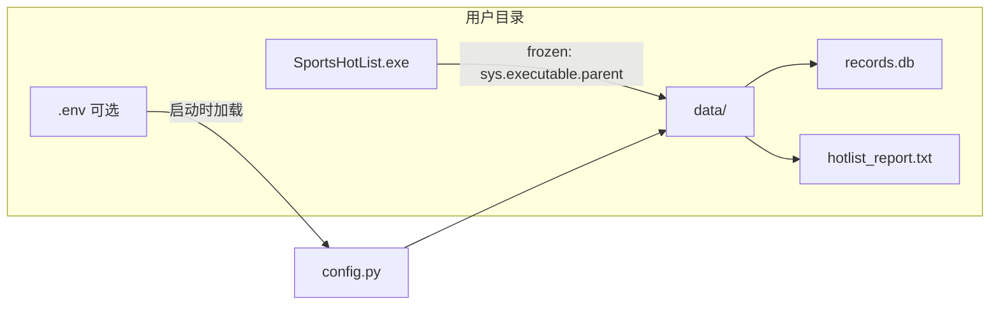

# PyInstaller 单文件 exe 打包方案

## 背景

当前入口为 [`main.py`](main.py) → [`gui.run_app()`](gui.py)，依赖见 [`requirements.txt`](requirements.txt)（requests、beautifulsoup4、APScheduler、tzdata）。项目尚无打包配置。

**关键问题**：[`config.py`](config.py) 使用 `Path(__file__).parent` 作为 `BASE_DIR`：

```4:5:config.py
BASE_DIR = Path(__file__).resolve().parent
DATA_DIR = BASE_DIR / "data"
```

PyInstaller `--onefile` 运行时，`__file__` 指向临时解压目录（`_MEIPASS`），若不改会导致 SQLite 和报告写入临时目录，关闭后数据丢失。

## 目标产物

- 单文件：`dist/SportsHotList.exe`（无控制台窗口）
- 用户将 exe 放在任意目录运行
- 同目录自动创建 `data/records.db`、`data/hotlist_report.txt`
- 可选：同目录 `.env` 配置 PushPlus（当前仅支持系统环境变量，exe 分发不便）

## 架构（路径与数据流）



## 实现步骤

### 1. 修复 frozen 路径 + 可选 `.env` 加载 — [`config.py`](config.py)

新增路径解析函数（开发模式与打包模式统一）：

```python
import sys

def _resolve_base_dir() -> Path:
    if getattr(sys, "frozen", False):
        return Path(sys.executable).resolve().parent
    return Path(__file__).resolve().parent

BASE_DIR = _resolve_base_dir()
DATA_DIR = BASE_DIR / "data"
```

新增轻量 `.env` 加载（**不引入 python-dotenv**，保持依赖不变）：

- 启动时读取 `BASE_DIR / ".env"`
- 仅设置尚未存在于 `os.environ` 的变量（系统环境变量优先）
- 解析 `KEY=VALUE`、忽略空行与 `#` 注释
- 使现有 `PUSHPLUS_TOKEN` 等 `os.getenv` 逻辑无需改动

### 2. 新增 PyInstaller spec — [`SportsHotList.spec`](SportsHotList.spec)

提交 spec 文件便于复现构建，核心配置：

| 选项 | 值 | 说明 |
|------|-----|------|
| `entry` | `main.py` | GUI 入口 |
| `onefile` | True | 单 exe |
| `console` | False | 隐藏控制台（`-w`） |
| `name` | `SportsHotList` | 输出文件名 |

**hiddenimports**（APScheduler 子模块在 frozen 下常被漏收集）：

- `apscheduler.schedulers.background`
- `apscheduler.triggers.cron`
- `apscheduler.triggers.interval`
- `apscheduler.executors.pool`
- `apscheduler.executors.default`

**collect_all**：`tzdata`（[`timezone_utils.py`](timezone_utils.py) 依赖 `Asia/Shanghai` 时区数据）

不打包 `data/` 目录内容（用户运行时自动创建空库）；不打包 `.env`（含密钥）。

### 3. 新增构建脚本 — [`build.ps1`](build.ps1)

PowerShell 一键构建（Windows 环境）：

```powershell
# 1. 创建/激活 venv（若不存在）
# 2. pip install -r requirements.txt
# 3. pip install pyinstaller
# 4. pyinstaller --noconfirm SportsHotList.spec
# 5. 输出 dist/SportsHotList.exe
```

`pyinstaller` 仅作为构建依赖，**不写入** [`requirements.txt`](requirements.txt)（避免污染运行时依赖）。

### 4. 更新忽略规则 — [`.gitignore`](.gitignore)

追加：

```
build/
dist/
*.spec.bak
```

保留已提交的 `SportsHotList.spec`。

### 5. 更新文档 — [`README.md`](README.md)

新增「打包为 exe」小节：

- 运行 `.\build.ps1` 或手动 `pyinstaller SportsHotList.spec`
- 产物路径：`dist/SportsHotList.exe`
- 使用说明：将 exe 复制到目标目录；首次运行自动创建 `data/`；PushPlus 配置方式（同目录 `.env` 或系统环境变量）
- 开机自启：任务计划程序指向 `SportsHotList.exe` 完整路径（不再需要 `python.exe` + `main.py`）

## 验证清单

1. 本地执行 `.\build.ps1`，确认 `dist/SportsHotList.exe` 生成且无报错
2. 将 exe 复制到**空目录**（无 `data/`），双击启动 → 窗口正常、首次抓取成功
3. 确认 `data/records.db` 和 `data/hotlist_report.txt` 出现在 exe 同目录（而非临时目录）
4. 测试历史记录 / 热榜计数标签页能读取新库数据
5. 在 exe 同目录放置 `.env`（含 `PUSHPLUS_TOKEN`），重启后推送联调可用（可选）
6. 关闭窗口后进程完全退出，无残留 python 进程

## 风险与处理

| 风险 | 处理 |
|------|------|
| APScheduler 模块漏收集 | spec 中显式 hiddenimports |
| 时区 `Asia/Shanghai` 报错 | `collect_all('tzdata')` |
| 杀毒软件误报 onefile exe | 常见现象；可说明为 PyInstaller 打包；若严重可改用 onedir |
| exe 体积较大（~30–50MB） | Python + 依赖打包的正常体积，可接受 |

## 不改动的部分

- [`gui.py`](gui.py)、[`monitor.py`](monitor.py)、[`scraper.py`](scraper.py) 等业务逻辑
- [`requirements.txt`](requirements.txt) 运行时依赖
- [`verify.py`](verify.py) 不打包（开发/联调脚本，仍用 `python verify.py`）
