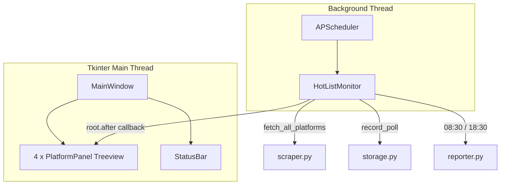

# 体育热榜 Tkinter 桌面窗口方案

## 目标

把当前 CLI 常驻进程（[`main.py`](main.py)）改为 **Tkinter 桌面窗口**，在窗口内实时展示每次抓取到的 4 平台 Top10 热榜；后台仍每 5 分钟自动刷新，并继续写入 SQLite、生成早晚报告。

## 架构



**线程模型**：APScheduler 在后台线程执行 `poll_once()`；抓取完成后通过 `root.after(0, ...)` 将 UI 更新调度到 Tkinter 主线程，避免跨线程直接操作控件。

## 文件改动

| 文件 | 动作 |
|------|------|
| [`monitor.py`](monitor.py) | **新建**：从 `main.py` 抽出 `HotListMonitor`，增加 poll 完成回调 |
| [`gui.py`](gui.py) | **新建**：Tkinter 窗口、4 平台面板、状态栏、刷新/关闭逻辑 |
| [`main.py`](main.py) | **改写**：仅作为 GUI 入口 `run_app()` |
| [`README.md`](README.md) | **更新**：运行方式改为启动桌面窗口 |

其余模块（[`scraper.py`](scraper.py)、[`storage.py`](storage.py)、[`reporter.py`](reporter.py)、[`config.py`](config.py)）**不改动**。

## 1. 抽出 `HotListMonitor` → [`monitor.py`](monitor.py)

从现有 [`main.py`](main.py) 迁移 `HotListMonitor` 类，做最小扩展：

```python
# 新增可选回调，poll 完成后通知 GUI
def __init__(self, on_poll_complete: Callable[[dict, datetime], None] | None = None):
    self.on_poll_complete = on_poll_complete
    ...

def poll_once(self) -> dict[str, list[HotItem]]:
  results = fetch_all_platforms(session=self.session)
  # ... 现有 storage 逻辑不变 ...
  if self.on_poll_complete:
      self.on_poll_complete(results, now)
  return results
```

- 保留 scheduler：5 分钟轮询 + 08:30/18:30 报告任务
- 保留 `start()` / `stop()` 生命周期
- 移除 CLI 专用的 `signal` / `threading.Event().wait()` 阻塞逻辑（改由 GUI 事件循环接管）

## 2. 新建 [`gui.py`](gui.py) — Tkinter 界面

### 窗口布局

```
┌─ 体育热榜监控 ─────────────────── [立即刷新] ─┐
│  新浪体育新闻          │  抖音体育榜            │
│  # │ 标题              │  # │ 标题              │
│  1 │ ...               │  1 │ ...               │
├────────────────────────┼────────────────────────┤
│  虎扑NBA热帖           │  懂球帝今日头条         │
│  # │ 标题              │  # │ 标题              │
└─────────────────────────────────────────────────┘
  状态：就绪 | 上次更新 2026-05-24 12:00:00
```

- 使用 `ttk.LabelFrame` + `ttk.Treeview`（列：`#`、`标题`），2×2 网格排列 4 平台
- 字体：`Microsoft YaHei`（Windows 中文显示）
- 每个 Treeview 维护 `item_id → url` 映射；**双击行**用 `webbrowser.open()` 打开链接
- 标题过长时 Treeview 自动截断，完整标题通过 `tooltip` 或选中后在状态栏显示（实现简单 tooltip 即可）

### 实时更新逻辑

- `HotListApp.__init__`：创建 `HotListMonitor(on_poll_complete=self._schedule_ui_update)`
- `_schedule_ui_update(results, polled_at)`：`self.root.after(0, lambda: self._refresh_panels(results, polled_at))`
- `_refresh_panels`：清空各 Treeview，按 `config.PLATFORMS` 顺序填入 rank/title；某平台为空或抓取失败时显示「暂无数据」
- 抓取进行中：点击「立即刷新」或自动轮询时，状态栏显示「正在抓取...」

### 生命周期

- 启动：`monitor.start()` → 立即触发首次 poll → 窗口展示数据
- 关闭：绑定 `WM_DELETE_WINDOW`，先 `monitor.stop()` 再 `root.destroy()`
- 「立即刷新」按钮：在后台线程调用 `monitor.poll_once()`（加 `threading.Lock` 或与 scheduler 的 `max_instances=1` 配合，避免并发重复抓取）

## 3. 改写 [`main.py`](main.py)

```python
from gui import run_app

if __name__ == "__main__":
    run_app()
```

## 4. 更新 [`README.md`](README.md)

- 运行命令仍为 `python main.py`，说明改为「启动桌面监控窗口」
- 补充界面操作：双击打开链接、手动刷新、自动 5 分钟刷新
- 保留数据文件、报告时间、开机自启说明（自启仍指向 `main.py`）

## 依赖

- **不新增依赖**：Tkinter 为 Python 标准库（Windows 官方 Python 安装包自带）
- [`requirements.txt`](requirements.txt) 无需修改

## 验证方式

1. `python main.py` → 窗口弹出，首次加载后 4 平台各有 Top10 条目
2. 等待或点击「立即刷新」→ 状态栏时间更新、列表刷新
3. 双击某条标题 → 浏览器打开对应 URL
4. 关闭窗口 → 进程正常退出，无 scheduler 残留
5. `python verify.py` → 原有验证脚本仍可通过（独立运行，不依赖 GUI）

## 风险与处理

| 风险 | 处理 |
|------|------|
| 后台线程直接改 UI | 统一走 `root.after()` |
| 手动刷新与定时任务冲突 | scheduler 已设 `max_instances=1`；手动刷新同样复用 `poll_once()` |
| 某平台抓取失败 | 该平台面板保留上次数据或显示「抓取失败」，状态栏提示 |
| 中文乱码 | Treeview 使用 UTF-8 字符串 + YaHei 字体 |
