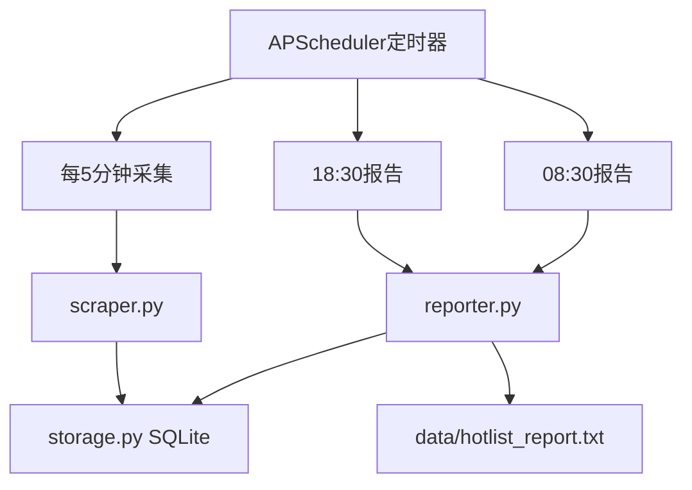

# 体育热榜 24 小时监控程序

## 目标与约束

- **数据源**：[tophub.today](https://tophub.today/) 体育板块下 4 个榜单（已确认节点 hashid）：

| 平台 | 榜单 | 节点 URL |
|------|------|----------|
| 新浪体育新闻 | 点击量排行 | `https://tophub.today/n/wWmoOqYd4E` |
| 抖音 | 体育榜 | `https://tophub.today/n/3adqqzadng` |
| 虎扑社区 | NBA论坛热帖 | `https://tophub.today/n/6ARe1YLe7n` |
| 懂球帝 | 今日头条 | `https://tophub.today/n/n3moBE1eN5` |

- **采集频率**：每 5 分钟 HTTP 请求一次（等价于 F5 刷新，无需 Playwright，更轻量稳定）
- **记录规则**：每次抓取每个榜单 **前 10 名**，每条记 **+1 次出现**（同一标题在单次抓取中只计 1 次）
- **汇总规则**（用户已确认）：
  - **按平台 Top5**：4 个平台各自输出出现次数最多的 5 条
  - **全站 Top5**：4 个平台合并后输出出现次数最多的 5 条
- **报告时间**（时区 `Asia/Shanghai`）：
  - **18:30** → 统计 `[08:30, 18:30]` 共 10 小时
  - **08:30** → 统计 `[昨日 18:30, 08:30]` 共 14 小时
- **输出文件**：追加写入同一文件，如 `data/hotlist_report.txt`

## 架构



## 项目结构（当前仓库为空，需新建）

```
Sports-Hot-List-Push/
├── main.py              # 入口：启动调度器 + 首次立即采集
├── config.py            # 节点配置、时间窗口、文件路径
├── scraper.py           # 抓取 + 解析 Top10
├── storage.py           # SQLite 读写
├── reporter.py          #ax# 汇总 Top5 并写文件
├── requirements.txt
├── README.md
└── data/
    ├── records.db       # 运行时生成
    └── hotlist_report.txt
```

## 核心实现细节

### 1. 抓取与解析 [`scraper.py`](scraper.py)

- 使用 `requests` + `BeautifulSoup`，带浏览器 User-Agent
- 对每个节点页 `GET /n/{hashid}`，解析榜单条目
- 解析策略（参考 [todayNews.py](https://github.com/Yxiaokuan/todayNews) 及节点页实测结构）：
  - 优先解析 `div.cc-cd` / 表格行 / 带排名的 `<a>` 链接
  - 提取：`rank`（1-10）、`title`（去掉热度后缀如「次播放」「亮」「3,406」）、`url`（原始外链）
- **条目去重键**：`(platform, normalized_url)`，若无 url 则 `(platform, normalized_title)`
- 仅保留 rank ≤ 10 的条目；解析失败时记录日志，不中断其他平台

### 2. 数据存储 [`storage.py`](storage.py)

SQLite 表 `appearances`：

```sql
CREATE TABLE appearances (
  id INTEGER PRIMARY KEY AUTOINCREMENT,
  platform TEXT NOT NULL,
  title TEXT NOT NULL,
  url TEXT,
  rank INTEGER,
  polled_at TEXT NOT NULL  -- ISO8601, Asia/Shanghai
);
CREATE INDEX idx_appearances_time ON appearances(polled_at);
CREATE INDEX idx_appearances_platform ON appearances(platform, polled_at);
```

- `record_poll(platform, items, polled_at)`：批量插入本次 Top10
- `count_in_window(start, end)`：按 `(platform, title, url)` 分组 `COUNT(*)`
- 可选：定期清理 30 天前数据，避免库无限增长

### 3. 报告生成 [`reporter.py`](reporter.py)

写入 `data/hotlist_report.txt`，追加格式示例：

```
==================================================
报告时间: 2026-05-24 18:30:00
统计窗口: 2026-05-24 08:30 ~ 2026-05-24 18:30 (10小时)
采集次数: 约 120 次

【新浪体育新闻 Top5】
1. (23次) 拜仁成功加冕国内三冠王...
...

【抖音体育榜 Top5】
...

【虎扑社区 Top5】
...

【懂球帝 Top5】
...

【全站综合 Top5】
1. (31次) [抖音] 詹姆斯和你做队友是什么感觉...
...
==================================================
```

- 全站 Top5：`GROUP BY title, url` 跨平台合并，输出时标注来源平台
- 并列时：次数相同按最近出现时间、标题字典序作为 tie-breaker

### 4. 调度 [`main.py`](main.py)

- 使用 `APScheduler`（`BackgroundScheduler` + `Asia/Shanghai`）
- 三个 Job：
  - `poll_job`：`interval=5 minutes`
  - `evening_report_job`：`cron hour=18, minute=30`
  - `morning_report_job`：`cron hour=8, minute=30`
- 启动时立即执行一次采集，避免冷启动空窗
- 支持 `Ctrl+C` 优雅退出
- Windows 下可用 `python main.py` 前台运行；README 补充「任务计划程序」开机自启说明

### 5. 配置 [`config.py`](config.py)

```python
PLATFORMS = {
    "sina_sports": {"name": "新浪体育新闻", "hashid": "wWmoOqYd4E"},
    "douyin_sports": {"name": "抖音体育榜", "hashid": "3adqqzadng"},
    "hupu_nba": {"name": "虎扑NBA热帖", "hashid": "6ARe1YLe7n"},
    "dongqiudi": {"name": "懂球帝今日头条", "hashid": "n3moBE1eN5"},
}
POLL_INTERVAL_MINUTES = 5
TOP_N_TRACK = 10
TOP_N_REPORT = 5
REPORT_FILE = "data/hotlist_report.txt"
DB_PATH = "data/records.db"
TIMEZONE = "Asia/Shanghai"
```

## 依赖

[`requirements.txt`](requirements.txt)：

```
requests>=2.31.0
beautifulsoup4>=4.12.0
APScheduler>=3.10.0
tzdata>=2024.1   # Windows 时区支持
```

## 风险与应对

| 风险 | 应对 |
|------|------|
| tophub 页面结构变更 | 解析器集中在一处；解析不到条目时打 warning 并保留原始 HTML 片段到日志 |
| 反爬/限流 | 固定 5 分钟间隔 + 合理 UA；失败时指数退避重试 1 次 |
| 付费 API 不可用 | 不依赖 `api.tophubdata.com`（需 Authorization），纯 HTML 抓取 |
| 标题含热度数字导致重复 | 归一化标题：剥离「次播放」「亮」、末尾数字热度 |
| 进程意外退出 | README 说明用 Windows 任务计划或 `nssm` 守护重启 |

## 验证方式

1. 手动运行 `python main.py`，观察首次采集是否写入 SQLite
2. 临时将报告 cron 改为「启动后 2 分钟」触发，检查 `hotlist_report.txt` 格式
3. 模拟：插入测试数据验证 10h/14h 窗口边界（08:30、18:30）正确
4. 连续运行 15 分钟（3 次采集），确认同一热榜条目计数递增
