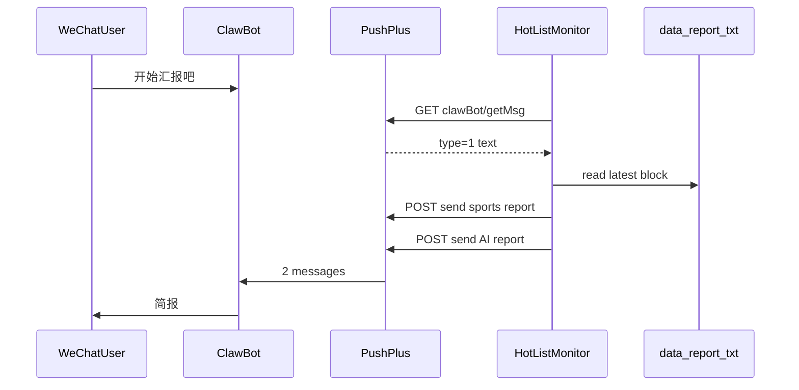

# 微信「开始汇报吧」指令重发落盘简报

## 背景

当前项目**只有出站推送**（[`pushplus.py`](pushplus.py) → PushPlus → 微信 ClawBot），没有读取用户消息的逻辑。落盘简报在 [`reporter.py`](reporter.py) 中按块追加到固定文件（[`config.py`](config.py) 中 `REPORT_FILE` / `AI_REPORT_FILE`），定时任务在 [`monitor.py`](monitor.py) 的 08:30 / 18:30 **生成后立即推送**，并不从磁盘回读。

PushPlus 开放接口提供 ClawBot 入站能力（需 `access-key`，与现有投递校验共用 `PUSHPLUS_SECRET_KEY`）：

- **轮询入站**：`GET https://www.pushplus.plus/api/open/clawBot/getMsg`
- **出站回复/重发**：沿用现有 `POST /send` + `send_report_with_retry`

你已确认推送范围为 **2 条**（体育整份 + AI 整份），与定时任务一致。



## 实现方案

### 1. 配置项 — [`config.py`](config.py)

新增（均可通过 `.env` 覆盖）：

| 变量 | 默认 | 说明 |
|------|------|------|
| `PUSHPLUS_CLAWBOT_MSG_URL` | `https://www.pushplus.plus/api/open/clawBot/getMsg` | 入站消息 API |
| `PUSHPLUS_CMD_ENABLED` | 有 `PUSHPLUS_SECRET_KEY` 且 `PUSHPLUS_ENABLED` 时为 true | 无 SecretKey 时无法拉取入站，应关闭并打日志 |
| `PUSHPLUS_CMD_POLL_SECONDS` | `20` | 轮询间隔（秒），与 5 分钟抓取解耦 |
| `REPORT_COMMAND_TEXT` | `开始汇报吧` | 触发短语（见下匹配规则） |

**前置条件（写入 README）**：除现有 `PUSHPLUS_TOKEN`、ClawBot 绑定外，必须配置 **`PUSHPLUS_SECRET_KEY`**（开放接口 access-key），且运行机 IP 在 PushPlus 白名单内（若已启用）。

### 2. 读取最新落盘块 — [`reporter.py`](reporter.py)

新增小函数（不改动现有生成逻辑）：

```python
def read_latest_report_block(report_file: Path) -> Optional[str]:
    # 按 "=" * 50 分块，取最后一个非空块（需含「报告类型:」）
```

- 从块内解析 `报告类型:`、`分类:` 行，供标题使用（复用 [`build_push_title`](pushplus.py) 的 `报告时间:` 解析日期）。
- 文件不存在或尚无有效块时返回 `None`。

手动重发标题建议：`build_push_title(prefix, f"{report_label} (手动重发)", content)`，与定时推送区分。

### 3. PushPlus 入站轮询 — [`pushplus.py`](pushplus.py)

新增：

- `fetch_clawbot_inbound_messages(session) -> list[dict]`  
  - `get_access_key()` → `GET clawBot/getMsg`，header `access-key`
  - 只保留 `type == 1`（文字）；忽略语音 `type == 3`
- `normalize_command_text(text) -> str`  
  - `strip()`、合并空白，便于匹配
- `is_report_command(text) -> bool`  
  - 精确匹配 `REPORT_COMMAND_TEXT`（规范化后）；可选兼容无「吧」：`开始汇报`（实现时二选一或都支持，默认以用户原文为准）

**去重策略**（API 无消息 ID，文档未说明拉取后是否清空）：

- 在 [`monitor.py`](monitor.py) 或单独 `clawbot_cmd.py` 维护 `_last_seen_msgs: set[tuple[int, str]]`（上一轮 poll 的 `(type, text)` 快照）。
- 每轮仅处理 **`current - last_seen`** 中命中指令的消息；然后更新快照为 `current`。
- 这样：用户再次发送相同文案时，只要 PushPlus 将其作为新一条返回（常见于未读队列），即可再次触发；若 API 长期返回全量历史，则同文案不会重复触发（需在 README 说明）。

### 4. 重发编排 — [`monitor.py`](monitor.py)

新增方法（与 `_run_category_report` 对称，但**不调用** `generate_*_report`）：

```python
def resend_latest_reports(self) -> None:
    for category in (CATEGORY_SPORTS, CATEGORY_AI):
        path = CATEGORIES[category]["report_file"]
        content = read_latest_report_block(path)
        if not content:
            logger.warning("No on-disk report for %s, skip resend", category)
            continue
        # 从 content 解析 report_label（报告类型 行）
        title = build_push_title(prefix, f"{label} (手动重发)", content)
        send_report_with_retry(title, content, session=self.session)
```

- 使用现有 `threading.Lock` 或单独 `_report_lock`：与 `run_evening_report` / `run_morning_report` 互斥，避免与定时报告并发推送。
- `check_wechat_commands()`：拉消息 → 若有新指令 → `resend_latest_reports()`；可选先发一条短 ack（`已收到，正在重发最新简报…`），失败不影响主流程。

在 `start()` 中增加 APScheduler 任务：

```python
IntervalTrigger(seconds=PUSHPLUS_CMD_POLL_SECONDS)
id="clawbot_cmd_job"
```

仅当 `PUSHPLUS_CMD_ENABLED` 且 `PUSHPLUS_CHANNEL == "clawbot"` 时注册。

### 5. 文档与验证

- **[`README.md`](README.md)**：新增「微信指令重发」小节——触发语、需 SecretKey、轮询间隔、2 条消息说明、去重行为。
- **[`verify.py`](verify.py)**（可选小测）：对 `read_latest_report_block` 使用现有 `data/test_*.txt` 断言能解析最后一块；**不**默认走真实 getMsg（避免依赖线上 ClawBot）。

## 不涉及的范围

- 不拆成「每个 AI 卡片 / 每个体育平台」多条推送（已确认）。
- 不引入本地 HTTP webhook 服务（PushPlus 入站为轮询 API，非回调到本机）。
- GUI 不新增按钮（行为由微信指令驱动；日志可在现有 monitor 日志中查看）。

## 风险与注意

| 风险 | 缓解 |
|------|------|
| 未配置 SecretKey | `PUSHPLUS_CMD_ENABLED=false`，启动时 `logger.info` 说明 |
| getMsg 返回重复历史 | 快照差分去重；README 说明 |
| 落盘文件尚无报告 | 跳过该分类并打 warning |
| ClawBot 10 条/24h 限制 | 重发仍走出站 push，用户需保持与 Bot 的对话活跃（与现有一致） |
| 简报很长 | 仍用 `template: txt`；与定时推送相同长度限制 |

## 关键文件

- [`config.py`](config.py) — 轮询与指令配置
- [`reporter.py`](reporter.py) — `read_latest_report_block`
- [`pushplus.py`](pushplus.py) — `fetch_clawbot_inbound_messages`、指令匹配
- [`monitor.py`](monitor.py) — 定时轮询 job + `resend_latest_reports`
- [`README.md`](README.md) — 使用说明
